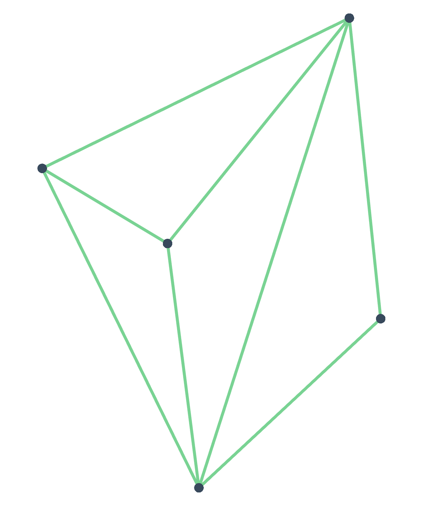

# Delaunay Triangulation - Lawson Flip Algorithm

### Running the app
This project was bootstrapped with Create React App; run `npm install` to get dependencies and `yarn start` to fire up the dev server. Check out `create-react-app.md` for other options.

The app will generate an edge-less graph of 10 randomly placed nodes by default. Click 'Load Random Graph' to generate a new one, and feel free to tweak the parameters. You can also choose 'Load Sample Graph' for a basic example with an easy triangulation.

The 'Load Graph from URL' option allows you to visualize an arbitrary graph in JSON format. Make sure it follows the standard Sigma.js graph format as outlined .

To triangulate a loaded graph, click 'Scan Triangulation' to perform an initial triangulation (probably with lots of sliver triangles), then 'Delaunay Triangulation' to run the graph through the Lawson Flip algorithm.

## The Algorithm
Lawson Flip takes advantage of the relationship between local Delaunayhood and global Delaunayhood; if all edges of the graph are locally Delaunay, the graph must be a correct triangulation.

We achieve this result by iteratively checking each edge of a graph and flipping it if necessary.

### Initial Triangulation
To use Lawson Flip, we must first generate some naive triangulation of the graph. We do this using a scan triangulation, the theory of which is explained  on page 56.
We first sort the nodes of the graph by x coordinate (nodes with the same x are then sorted in ascending y order). We then find the first `m` nodes that can be triangulated, that is, that are not collinear, and connect them.
Edges are then drawn between each successive node in order and all previous nodes that can be reached without crossing another edge. This "reachability" is determined by checking the intersection between any potential edge and each existing edge using the method from  (Jonathan's answer).

This triangulation also generates a convex hull, which is unique for any 2d graph.

### Maps
Although our visualization engine expects the graph in the form of an array of nodes and an array of edges, we can get much better performance by using a hashmap of each of these, keyed by id, for constant time lookup of specific elements.
The hashmap of nodes also contains an array of adjacent edge ids for each node, which is updated each time an edge is flipped.

### The Stack
To begin algorithm, all edges of the graph are pushed onto a stack and marked. We then proceed in a loop as long as the stack is non-empty:
  - Pop the top edge from the stack and unmark it.
  - If the edge is along the convex hull, we can ignore it, since the hull won't change.
  - Otherwise, check if the edge is locally Delaunay by finding the four edges that form the surrounding quadrilateral (more on this below).
  - If it's already locally Delaunay, continue. Otherwise, flip to the other diagonal of the quadrilateral.
  - If the edge was flipped, check the local Delaunayhood of any of the four surrounding edges that are unmarked. If any one of them isn't locally Delaunay, push it onto the stack.

### Finding Quadrilateral Edges
This was probably the most challenging part. Visually it's easy to find the four edges that make up a quadrilateral defined by a given edge, but this isn't algorithmically trivial.

Using our map of node-to-edge adjacencies, we grab the list of edges adjacent to each vertex of the edge in question.
We then iterate through both (excluding the edge in question) in a nested loop until we find two edges that connect to the same node. We then add this pair to a list of candidates and note the common vertex. If we reach the end of the loop with only two candidate pairs, we're done.

If there are more than two candidate pairs, we have false positives for the check described above. They tend to look like this:

If the edge in question is the diagonal of the rightmost quadrilateral, note that the two leftmost edges of the graph also satisfy the common-node condition despite not being desired edges of the quadrilateral. If there are more than 2 candidate pairs, we filter out false positives by checking if any candidate pair "engulfs" another candidate pair; that is, we check if any vertices are within the area of the triangle defined by the potential false positive candidate and the diagonal in question. We use the technique outlined  to check if a given point is inside a given triangle.

### Determining Local Delaunayhood
We can use a particular property of pairs of triangles to easily check if a quadrilateral is a correct Delaunay subgraph: the triangulation meets the Delaunay condition if the angles at the two "outside vertices" (that is, the vertex of each triangle not shared with the other triangle) sum to less than 180 degrees.
This property is explained in a number of sources but most concisely in the "Visual Delaunay definition: Flipping" section of .

We can use the Law of Cosines to calculate the angle between any three points, making this check reasonably easy. (Implementation lives in the `calculateAngle` function in `src/delaunay/index.js`.)
